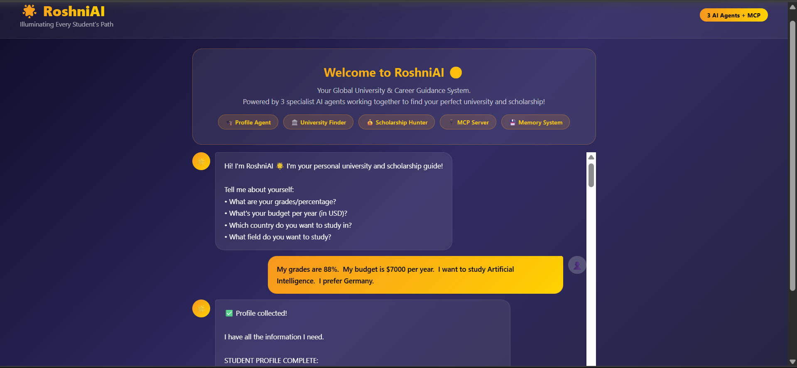

# 🌟 RoshniAI — Multi-Agent University Guide

> Illuminating Every Student's Path Worldwide

RoshniAI is a Multi-Agent AI system that helps students discover universities and scholarships worldwide. The project uses three specialist AI agents that work together to provide personalized guidance based on a student's profile.

---


## 📸 Project Preview

### RoshniAI Web Interface



---

## 🤖 Agent Architecture

### 👤 Profile Agent
- Collects student information
- Understands academic background and preferences

### 🎓 University Agent
- Supports university recommendations across 30+ countries 
- Matches universities according to the student's profile

### 💰 Scholarship Agent
- Suggests relevant scholarships and funding opportunities
- Helps students explore financial aid options

---

## ✨ Features

- 🤖 Multi-Agent AI Architecture
- 🎓 Personalized University Recommendations
- 💰 Scholarship Suggestions
- 🌍 Supports 30+ Countries
- 🧠 Agent Memory
- 🔄 Agent-to-Agent Communication (A2A)
- 🔌 MCP (Model Context Protocol) Server
- 🌐 Flask Web Interface
- 🔒 Input Validation and Security Checks

---

## 📚 AI Concepts Implemented

### ✅ Day 1
- Multi-Agent System

### ✅ Day 2
- MCP Server
- Agent Memory
- Agent-to-Agent Communication (A2A)

### ✅ Day 3
- Agent Skills using `SKILL.md`

### ✅ Day 4
- Security Evaluation
- Input and Output Validation

### ✅ Day 5
- Flask Web Deployment

---

## 🌍 Countries Covered

Pakistan, USA, UK, Canada, Australia, Germany, Turkey, Malaysia, Japan, China, South Korea, Singapore, India, Saudi Arabia, Qatar, UAE (Dubai), Switzerland, Ireland, and many more.

---

## 🛠 Technologies Used

- Python
- Flask
- Groq API
- MCP (Model Context Protocol)
- HTML5
- CSS3
- JavaScript 
- python-dotenv
- Gunicorn (deployment ready)

---

## 🚀 Installation

### 1. Clone the repository

```bash
git clone https://github.com/laibaazeem3250-ship-it/RoshniAI.git
cd RoshniAI
```

### 2. Install dependencies

```bash
pip install flask groq python-dotenv mcp
```

### 3. Create a `.env` file

```env
GROQ_API_KEY=your_api_key_here
```

### 4. Run the application

```bash
python app.py
```

### 5. Open your browser

```
http://localhost:5000
```

---

## 📁 Project Structure

```
RoshniAI/
│
├── agents/
│   ├── profile_agent.py
│   ├── university_agent.py
│   └── scholarship_agent.py
│
├── skills/
│   └── SKILL.md
│
├── templates/
│   └── index.html
│
├── app.py
├── main.py
├── mcp_server.py
├── memory.json
├── .env
├── .gitignore
└── README.md
```

---

## 📌 Note

This project was built for learning purposes as part of the **Google × Kaggle 5-Day AI Agents: Intensive Vibe Coding Course**.

University and scholarship recommendations are generated by AI and should always be verified through official university and scholarship websites.

---

## 👩‍💻 Author

**Laiba Azeem**

Student — University of Education, Lahore

Built as the **Day 5 Project** for the **Google × Kaggle 5-Day AI Agents: Intensive Vibe Coding Course**.

---

## ⭐ Support

If you found this project helpful, consider giving it a ⭐ on GitHub.
